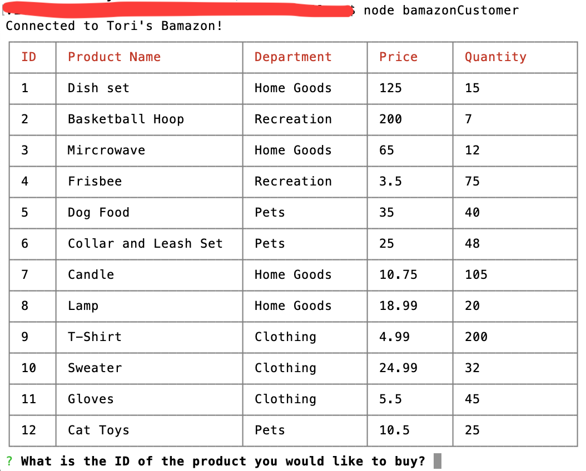
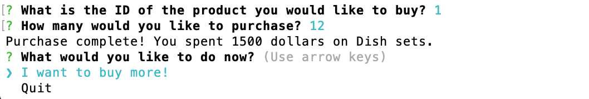
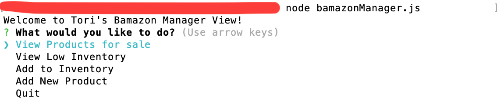
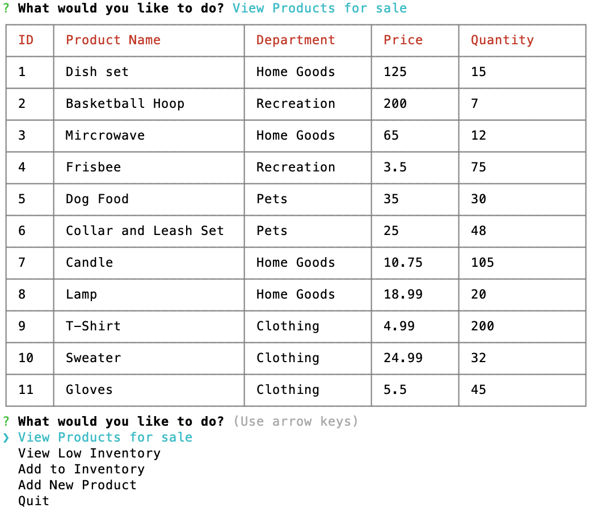
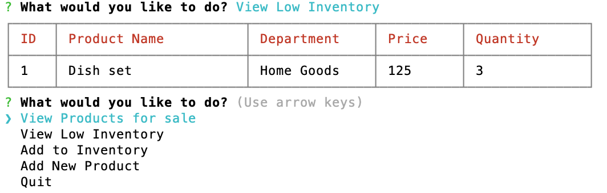
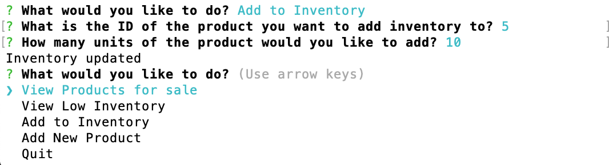
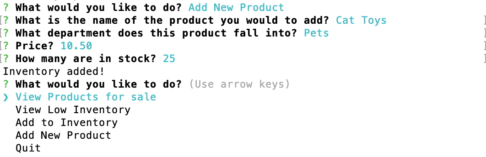

# Tori's Bamazon App
This Bamazon app is similar to the famous Amazon. Two views of the app are available: customer view and manager view.

### Usage
By entering specific commands in the command line, the user can view the app either as a customer or a manager. Depending on the view will determine which actions are available.

**Be sure to run "npm install" in command line before attempting the following prompts.**

##### Customer View
To view the app as a customer, use the following syntax in your command line:

     node bamazonCustomer.js 

###### Screen Shots:

As a customer you will be shown what is available for purchase and prompted on what you would like to buy:

##### Manager View
To view the app as a manager, use the following syntax in your command line:

     node bamazonManager.js

###### Screen Shots:

As a manager you will be prompted to chose from a selection of actions:

